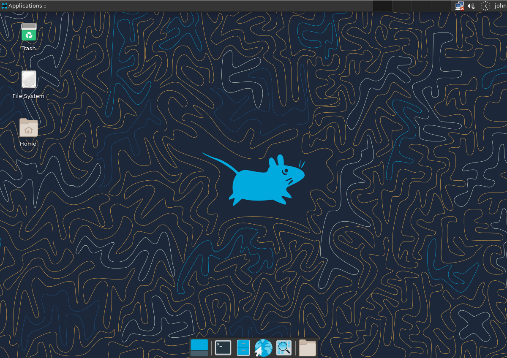

# 项目介绍
此项目在rockylinux:9官方docker镜像基础上配置xfce桌面环境与vnc服务

# 演示
- 连接VNC后


# 使用教程

## 下载项目
```shell
git clone https://github.com/heal2017/rocky-xfce-vnc.git
```

## 常用命令
- 构建镜像
```shell
docker-compose build vnc
```

- 启动容器
```shell
docker-compose up vnc -d
```

- 停止容器
```shell
docker-compose stop vnc
```

- 停止销毁容器
```shell
docker-compose down vnc
```

## FAQ
- 配置中文环境 (默认英文环境)
```shell
environment:
    LANG: "zh_CN.UTF-8"
```

- 修改root密码 (默认root密码: root)
```shell
environment:
    ROOT_PASSWORD: "password"
```

- 修改登录用户/密码
```
默认用户: john(1001)
组: john(1001)
密码: john
SHELL: /usr/bin/bash
```

```shell
environment:
    USERNAME: "username"
    UID: "1002"
    PASSWORD: "password"
    SHELL: "/usr/bin/bash"
```

- 修改主机名 (默认主机名为容器id)
```shell
environment:
    HOSTNAME: "rocky"
```

- 配置VNC无密码
```shell
environment:
    USE_VNC_PASSWORD: "false"
```

- 修改VNC密码 (默认VNC密码: password)
```shell
environment:
    USE_VNC_PASSWORD: "true"
    VNC_PASSWORD: "password"
```

- 修改VNC分辨率 (默认分辨率: 1920x1080)
```shell
environment:
    GEOMETRY: "2560x1440"
```

